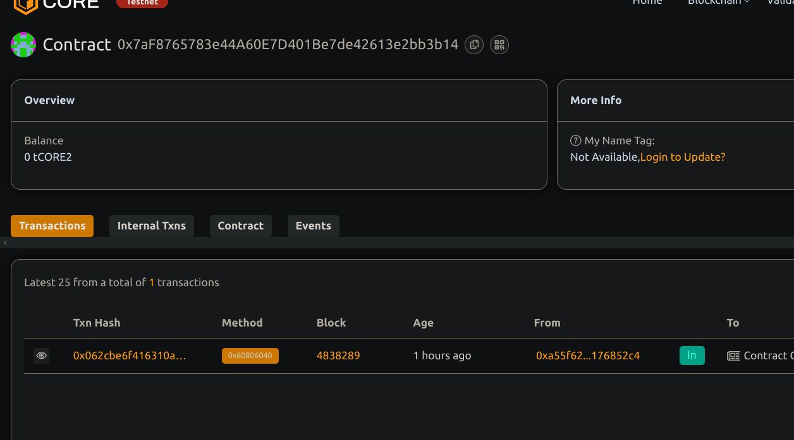

# Automated Market Maker with Customizable Fee Structures

## Project Description

This project implements a simplified Automated Market Maker (AMM) smart contract that allows users to create liquidity pools for token pairs, add liquidity, and perform swaps. Each pool can have a customizable fee structure, enabling a flexible approach to incentivizing liquidity providers. Its are workable and easiest or most expensive....

## Project Vision

To offer a lightweight, flexible, and customizable AMM that can be integrated into DEX platforms or used as a foundational layer for experimentation with different liquidity and fee models.

## Key Features

- Create AMM pools for token pairs with customizable fees
- Add liquidity to any existing pool
- Perform token swaps using a constant product formula
- Retrieve reserve data for pools
- Lightweight, gas-efficient design for testing and small-scale deployments

## Future Scope

- Add ERC20 token integration and on-chain balance checks
- Introduce LP token minting for liquidity providers
- Enable liquidity removal with proportional asset returns
- Incorporate price oracles and slippage protection
- Extend to stable swaps or concentrated liquidity models

## Contract details
0x7aF8765783e44A60E7D401Be7de42613e2bb3b14
created by - Rahul Kushwah 
